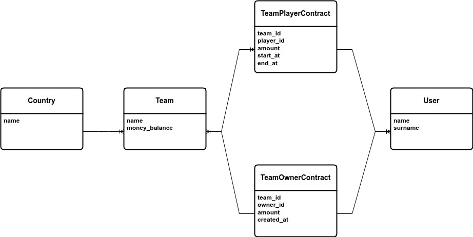

# Football Application

This application is a personal project that is using symfony framework. 

# Index
* [Requirements](#requirements)
* [Platforms](#platforms)
* [Run the application](#run-application)
* [Test the system functionality](#test)
* [Diagrams](#diagrams)

# Requirements

You need `docker` and `docker-compose` in order to run this application.
If you don't have `make` on your operating system for running the application,
you need to read `Makefile` and do as `up` method says, otherwise you just need
to follow [Running](#run-application) section.

# Platforms

## Linux

The application is listening to `football.test` as the domain address, and if you want to access
the application using this domain, and you're a linux user, you need to run this code.

```shell
echo '0.0.0.0 football.test' | sudo tee -a /etc/hosts
```

## Windows

For Windows 10 users it's a similar process, you need to add bellow code to the end of `hosts` file
in the `c:\Windows\System32\Drivers\etc\hosts` path.

**Attention:** you need to change space between `0.0.0.0` and `football.test` to tab character
for windows to work.

```shell
0.0.0.0 football.test
```

# Run Application

for running application you need to execute `up` method using `make` command
like bellow:

```shell
make up
```

# Test

you can run all system tests using `test` command like bellow.

```shell
make test
```

# Diagrams

The database design for the project.


